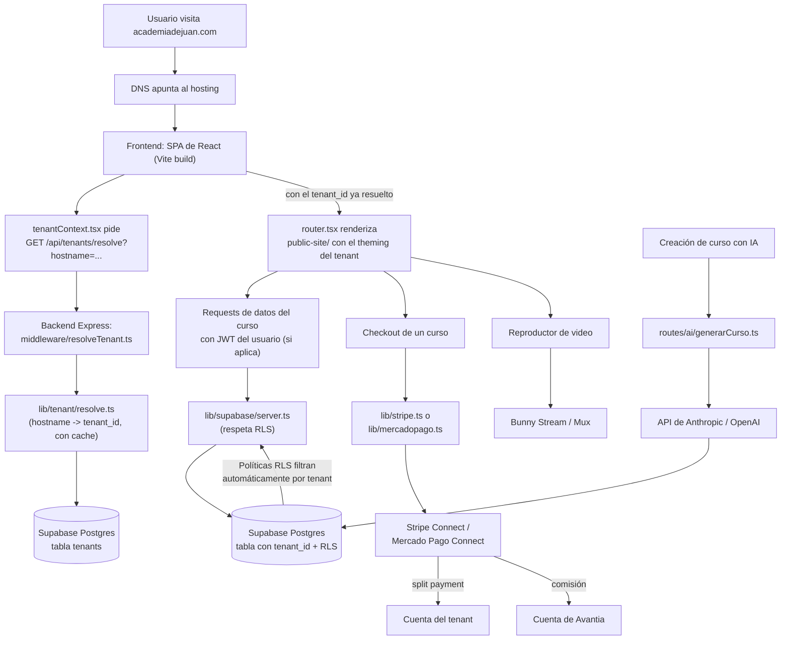
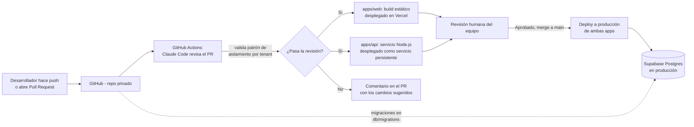

# Estructura de Código y Arquitectura Técnica — Avantia

> Stack: **Node.js (Express) + React (Vite)**, monorepo con npm workspaces.
> Ver [decisiones/001-migracion-nextjs-a-node-react.md](../decisiones/001-migracion-nextjs-a-node-react.md)
> para la razón del cambio de stack respecto a la versión anterior (Next.js).

## 1. Estructura de carpetas del proyecto

```
avantia/
├── apps/
│   ├── api/                          # Backend Node.js + Express + TypeScript
│   │   └── src/
│   │       ├── index.ts              # entrypoint, levanta el servidor HTTP
│   │       ├── app.ts                # ensamblado del Express app
│   │       ├── middleware/
│   │       │   └── resolveTenant.ts  # PIEZA CLAVE: resuelve qué tenant
│   │       │                         # corresponde según el hostname de la
│   │       │                         # request, antes de las rutas de negocio
│   │       ├── routes/
│   │       │   ├── webhooks/
│   │       │   │   ├── stripe.ts
│   │       │   │   └── mercadopago.ts
│   │       │   ├── ai/
│   │       │   │   └── generarCurso.ts   # endpoint IA: material crudo -> curso
│   │       │   └── tenants.ts            # alta/gestión/resolución de tenants
│   │       ├── lib/
│   │       │   ├── supabase/
│   │       │   │   ├── server.ts     # cliente por-request, respeta RLS
│   │       │   │   │                 # usando el JWT del usuario autenticado
│   │       │   │   └── admin.ts      # cliente con service role — SOLO uso
│   │       │   │                     # interno de backend, nunca expuesto
│   │       │   │                     # al cliente, bypassa RLS
│   │       │   ├── tenant/
│   │       │   │   └── resolve.ts    # hostname -> tenant (con cache)
│   │       │   ├── stripe.ts
│   │       │   ├── mercadopago.ts
│   │       │   └── ai/
│   │       │       └── generarCurso.ts   # lógica de prompting contra la API del LLM
│   │       └── types/
│   │           └── tenant.ts
│   │
│   └── web/                          # Frontend React + Vite + TypeScript (SPA)
│       └── src/
│           ├── dashboard/            # Panel interno: donde el dueño de cada
│           │   │                     # academia administra su cuenta
│           │   ├── DashboardLayout.tsx
│           │   ├── HomePage.tsx
│           │   ├── cursos/
│           │   │   ├── CursosPage.tsx
│           │   │   ├── NuevoCursoPage.tsx    # creación de curso (flujo con IA)
│           │   │   └── EditarCursoPage.tsx
│           │   ├── estudiantes/
│           │   │   └── EstudiantesPage.tsx
│           │   └── configuracion/
│           │       ├── DominioPage.tsx       # conectar dominio propio del tenant
│           │       └── MarcaPage.tsx         # logo, colores, theming
│           │
│           ├── public-site/          # Sitio público de cada academia,
│           │   │                     # resuelto en runtime según el hostname
│           │   ├── PublicLayout.tsx  # aplica el theming del tenant
│           │   ├── LandingPage.tsx   # landing de la academia
│           │   ├── CursoVentaPage.tsx    # página de venta de un curso
│           │   ├── AprenderPage.tsx      # reproductor del curso (alumno inscrito)
│           │   └── CheckoutPage.tsx
│           │
│           ├── components/
│           │   ├── ui/               # componentes genéricos reutilizables
│           │   └── tenant/           # componentes que aplican el theming
│           │                         # dinámico de cada academia
│           │
│           ├── lib/
│           │   ├── supabaseClient.ts # cliente Supabase del navegador
│           │   └── tenantContext.tsx # resuelve y provee el tenant activo
│           │
│           ├── router.tsx            # decide dashboard vs. sitio público
│           │                         # según el hostname (ver sección 4)
│           ├── App.tsx
│           └── main.tsx
│
├── db/
│   ├── migrations/                   # migraciones versionadas de Postgres
│   └── schema.sql                    # definición de tablas + políticas RLS
│
├── docs/                             # documentación del proyecto
│
├── .github/
│   └── workflows/
│       └── pr-review.yml             # Claude Code revisando cada PR
│
└── package.json                      # workspaces raíz del monorepo
```

### Por qué esta forma y no otra

- **`apps/api` y `apps/web` están separados** porque, a diferencia de Next.js,
  Node.js + React no ofrece un framework unificado que sirva páginas
  renderizadas en servidor y funciones API desde el mismo proyecto. El
  backend es un servicio Express persistente; el frontend es un SPA
  compilado con Vite y servido como archivos estáticos.

- **`middleware/resolveTenant.ts` es el corazón del multi-tenancy en el
  backend**, equivalente al `middleware.ts` de Next.js: se ejecuta en cada
  request de Express, antes de las rutas de negocio, y determina a qué
  tenant corresponde según el hostname (`academiadejuan.com` o
  `juan.avantia.app`).

- **En el frontend no hay edge middleware**, así que el sitio público
  (`public-site/`) resuelve el tenant activo **en el cliente**: al cargar,
  llama a `GET /api/tenants/resolve?hostname=...` contra el backend y
  provee el resultado vía `tenantContext.tsx`. `router.tsx` decide en
  runtime si mostrar el dashboard o el sitio público según el hostname,
  reemplazando lo que en Next.js resolvían los route groups `(dashboard)` y
  `(public)/[domain]` junto con el rewrite del middleware.

- **Dos clientes de Supabase en el backend, a propósito:** `server.ts`
  recibe el JWT del usuario autenticado (enviado por el frontend en el
  header `Authorization`) y respeta las políticas de Row-Level Security
  (así un profesor nunca puede leer datos de otro tenant aunque haya un bug
  en el código de la app, porque la base de datos misma lo bloquea).
  `admin.ts`, con service role, existe aparte y separado justamente para
  que sea imposible usarlo por error en una parte del código donde no
  corresponde — por ejemplo, `resolve.ts` lo necesita porque resolver el
  tenant de un hostname es una operación que por definición no puede
  filtrarse por `tenant_id` de antemano.

---

## 2. Diagrama de arquitectura — flujo de una request



---

## 3. Diagrama de despliegue — del commit a producción



---

## 4. Multi-tenancy sin edge middleware: cómo se resuelve

A diferencia de Next.js, un SPA de React no tiene un paso de "rewrite" que
corra antes del renderizado en el edge. El equivalente funcional se logra
así:

1. `apps/api/src/middleware/resolveTenant.ts` resuelve el tenant en el
   **backend**, en cada request a la API, a partir de `req.hostname`. Esto
   es indispensable para los endpoints (ej. `generarCurso`, `tenants`) que
   necesitan saber a qué tenant pertenece la operación.
2. `apps/web/src/lib/tenantContext.tsx` resuelve el tenant en el
   **frontend**, al cargar el sitio público, contra
   `GET /api/tenants/resolve?hostname=...`, y lo provee vía contexto de
   React a toda la sección `public-site/`.
3. `apps/web/src/router.tsx` decide, según el hostname (`app.avantia.app`
   vs. cualquier otro dominio), si montar las rutas del dashboard o las del
   sitio público — el equivalente a los route groups `(dashboard)` /
   `(public)/[domain]` de Next.js.

**Trade-off importante:** al ser un SPA sin server-side rendering, las
páginas públicas de venta de cursos (`CursoVentaPage.tsx`, `LandingPage.tsx`)
no tienen contenido en el HTML inicial — se llenan después de que el
JavaScript carga y resuelve el tenant. Esto es peor para SEO que la versión
con Next.js (que podía prerenderizar esas páginas en el servidor). Si el SEO
de las landings públicas se vuelve crítico para el negocio, la opción a
evaluar es agregar server-side rendering solo para `apps/web/src/public-site`
(por ejemplo con un framework de SSR para Vite, o sirviendo esas rutas desde
`apps/api` con una plantilla renderizada en servidor), manteniendo el
dashboard como SPA puro.

---

## 5. Notas para la implementación

- `middleware/resolveTenant.ts` corre en cada request al backend, así que
  debe ser liviano: `lib/tenant/resolve.ts` cachea en memoria el resultado
  por hostname (TTL de 60s) para no pegarle a la base de datos en cada
  llamada.
- Las políticas RLS de `db/schema.sql` son la última línea de defensa, pero
  como quedó definido antes, no hay que confiar solo en ellas: cada consulta
  desde `lib/supabase/server.ts` debería además filtrar explícitamente por
  `tenant_id` a nivel de aplicación.
- El endpoint `routes/ai/generarCurso.ts` es el único punto de la app que
  llama a la API del LLM — mantenerlo centralizado ahí facilita controlar
  costos y cambiar de proveedor (Anthropic/OpenAI) sin tocar el resto del
  código.
- El frontend nunca debe usar `lib/supabase/admin.ts` (no existe en
  `apps/web` por diseño): toda operación con service role vive
  exclusivamente en `apps/api`.
