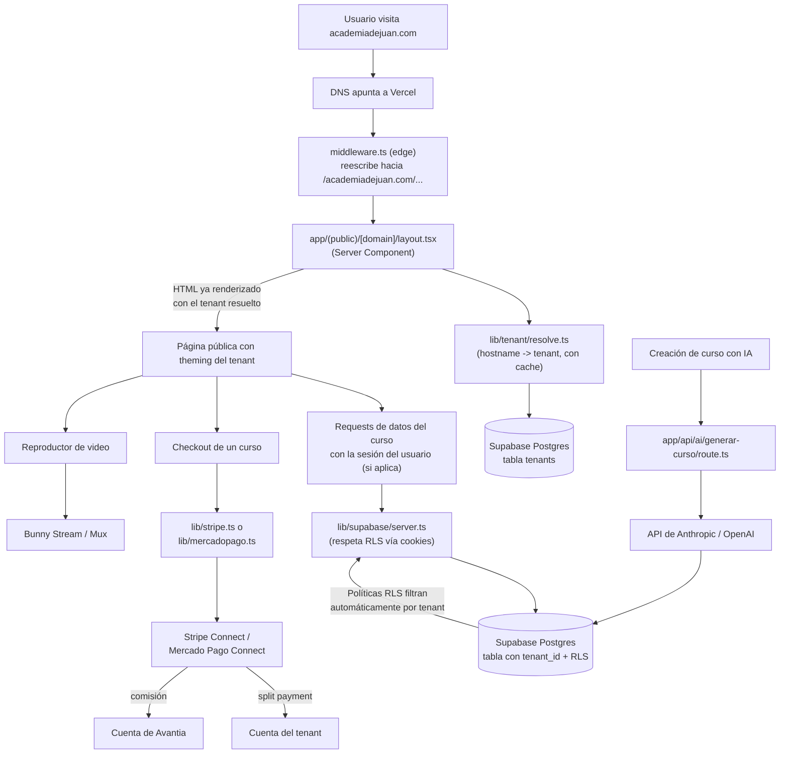
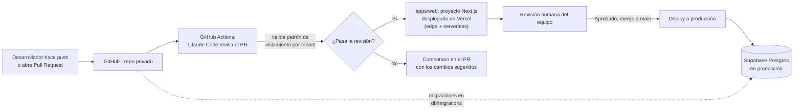

# Estructura de Código y Arquitectura Técnica — Avantia

> Stack: **Next.js (App Router) + TypeScript**, monorepo con npm workspaces
> (un único proyecto en `apps/web`).
> Ver [decisiones/002-vuelta-a-nextjs.md](../decisiones/002-vuelta-a-nextjs.md)
> para la razón de volver a Next.js respecto a la versión intermedia
> (Node.js + Express + React).
> Ver [Supuestos_y_Pendientes.md](Supuestos_y_Pendientes.md) para qué de este
> documento es firme y qué sigue provisional o sin resolver.

## 1. Estructura de carpetas del proyecto

```
avantia/
├── apps/
│   └── web/                          # Next.js (App Router) + TypeScript
│       ├── src/
│       │   ├── middleware.ts         # PIEZA CLAVE: corre en el edge, decide
│       │   │                         # panel vs. sitio público según el
│       │   │                         # hostname, antes de cualquier render
│       │   ├── app/
│       │   │   ├── layout.tsx        # layout raíz (html/body)
│       │   │   ├── (dashboard)/      # Panel interno: donde el dueño de cada
│       │   │   │   │                 # academia administra su cuenta
│       │   │   │   ├── layout.tsx
│       │   │   │   ├── page.tsx              # resumen
│       │   │   │   ├── cursos/
│       │   │   │   │   ├── page.tsx
│       │   │   │   │   ├── nuevo/page.tsx    # creación de curso (flujo con IA)
│       │   │   │   │   └── [cursoId]/page.tsx
│       │   │   │   ├── estudiantes/page.tsx
│       │   │   │   └── configuracion/
│       │   │   │       ├── dominio/page.tsx  # conectar dominio propio del tenant
│       │   │   │       └── marca/page.tsx    # logo, colores, theming
│       │   │   │
│       │   │   ├── (public)/         # Sitio público de cada academia
│       │   │   │   └── [domain]/     # segmento real: recibe el hostname que
│       │   │   │       │             # reescribe middleware.ts
│       │   │   │       ├── layout.tsx        # resuelve el tenant (Server
│       │   │   │       │                     # Component) y aplica theming
│       │   │   │       ├── page.tsx          # landing de la academia
│       │   │   │       ├── curso/[slug]/page.tsx     # venta de un curso
│       │   │   │       ├── aprender/[cursoId]/[leccionId]/page.tsx
│       │   │   │       └── checkout/page.tsx
│       │   │   │
│       │   │   └── api/              # Route handlers (reemplazan a Express)
│       │   │       ├── webhooks/
│       │   │       │   ├── stripe/route.ts
│       │   │       │   └── mercadopago/route.ts
│       │   │       ├── ai/
│       │   │       │   └── generar-curso/route.ts
│       │   │       ├── tenants/
│       │   │       │   ├── route.ts          # POST: alta de tenant
│       │   │       │   └── resolve/route.ts  # GET: usado por Client Components
│       │   │       └── health/route.ts
│       │   │
│       │   ├── components/
│       │   │   ├── ui/               # componentes genéricos reutilizables
│       │   │   └── tenant/           # componentes que aplican el theming
│       │   │                         # dinámico de cada academia
│       │   │
│       │   ├── lib/
│       │   │   ├── supabase/
│       │   │   │   ├── server.ts     # cliente por-request (Server Components/
│       │   │   │   │                 # route handlers), respeta RLS vía cookies
│       │   │   │   ├── client.ts     # cliente del navegador (Client Components)
│       │   │   │   └── admin.ts      # service role — SOLO server, bypassa RLS
│       │   │   ├── tenant/
│       │   │   │   └── resolve.ts    # hostname -> tenant (con cache)
│       │   │   ├── tenantContext.tsx # expone el tenant ya resuelto a los
│       │   │   │                     # Client Components del sitio público
│       │   │   ├── stripe.ts
│       │   │   ├── mercadopago.ts
│       │   │   └── ai/
│       │   │       └── generarCurso.ts   # lógica de prompting contra la API del LLM
│       │   └── types/
│       │       └── tenant.ts
│       └── next.config.ts
│
├── db/
│   ├── migrations/                   # migraciones versionadas de Postgres
│   └── schema.sql                    # definición de tablas + políticas RLS
│
├── docs/                             # documentación del proyecto
│
├── .github/
│   └── workflows/
│       └── pr-review.yml             # Claude Code revisando cada PR
│
└── package.json                      # workspaces raíz del monorepo
```

### Por qué esta forma y no otra

- **Un único proyecto Next.js** sirve panel, sitio público y API desde el
  mismo codebase: las funciones serverless/edge de Next.js reemplazan al
  servicio Express separado que tenía la versión intermedia del stack.

- **`middleware.ts` es el corazón del multi-tenancy**: corre en el edge, en
  cada request, y decide entre las dos familias de rutas según el hostname
  (`academiadejuan.com` / `juan.avantia.app` -> sitio público;
  `app.avantia.app` o `localhost` -> panel). Para el sitio público, reescribe
  el pathname hacia el segmento real `[domain]` (los route groups
  `(dashboard)` y `(public)` no agregan segmento a la URL, así que hace
  falta un segmento real para que Next.js pueda distinguir cuál renderizar).
  A propósito **no** consulta la base de datos ahí: eso sería costoso en
  cada request de edge.

- **`app/(public)/[domain]/layout.tsx` resuelve el tenant contra Supabase**,
  ya en runtime Node.js (Server Component), y llama a `notFound()` si el
  hostname no corresponde a ningún tenant. Esta es la pieza que le devuelve
  al proyecto el SSR que se había perdido en la versión Node + React: el
  HTML de las páginas de venta sale con el contenido y el theming del tenant
  ya resueltos, sin esperar a que cargue JavaScript en el navegador.

- **Dos clientes de Supabase en el servidor, a propósito:** `server.ts` usa
  la sesión del usuario autenticado vía cookies (con `@supabase/ssr`) y
  respeta las políticas de Row-Level Security (así un profesor de un tenant
  nunca puede leer datos de otro tenant aunque haya un bug en el código de
  la app, porque la base de datos misma lo bloquea). `admin.ts`, con service
  role, existe aparte y separado justamente para que sea imposible usarlo
  por error en una parte del código donde no corresponde — por ejemplo,
  `lib/tenant/resolve.ts` lo necesita porque resolver el tenant de un
  hostname es una operación que por definición no puede filtrarse por
  `tenant_id` de antemano. Ninguno de los dos se importa nunca desde un
  Client Component.

---

## 2. Diagrama de arquitectura — flujo de una request



---

## 3. Diagrama de despliegue — del commit a producción



---

## 4. Multi-tenancy con Next.js: cómo se resuelve

1. `apps/web/src/middleware.ts` corre en el **edge**, en cada request, y
   decide según el hostname si la request es para el panel
   (`app/(dashboard)`) o para el sitio público de un tenant — en ese caso
   reescribe el pathname hacia `app/(public)/[domain]`, pasando el hostname
   como parámetro de ruta.
2. `app/(public)/[domain]/layout.tsx` resuelve el tenant real contra
   Supabase (Server Component, runtime Node.js) y devuelve 404
   (`notFound()`) si el hostname no corresponde a ninguna academia.
3. El tenant resuelto se expone a los Client Components descendientes (ej.
   el reproductor de video) vía `lib/tenantContext.tsx`, sin necesidad de un
   segundo fetch en el navegador — a diferencia de la versión SPA, donde
   `tenantContext.tsx` tenía que pedirlo por HTTP después de montar.

**Ganancia frente a Node + React puro:** las páginas públicas de venta de
cursos (`LandingPage`, `CursoVentaPage`) se renderizan en servidor, con el
contenido y el theming del tenant ya en el HTML inicial — mejor SEO, sin el
delay de loading que tenía la versión SPA.

---

## 5. Notas para la implementación

- `middleware.ts` corre en cada request, así que debe ser liviano: no
  consulta la base de datos, solo hostname -> reescritura de path.
  `lib/tenant/resolve.ts` (que sí consulta Supabase) corre en el layout,
  runtime Node.js, y cachea en memoria el resultado por hostname (TTL de
  60s) para no pegarle a la base de datos en cada render.
- Las políticas RLS de `db/schema.sql` son la última línea de defensa, pero
  como quedó definido antes, no hay que confiar solo en ellas: cada consulta
  desde `lib/supabase/server.ts` debería además filtrar explícitamente por
  `tenant_id` a nivel de aplicación.
- El route handler `app/api/ai/generar-curso/route.ts` es el único punto de
  la app que llama a la API del LLM — mantenerlo centralizado ahí facilita
  controlar costos y cambiar de proveedor (Anthropic/OpenAI) sin tocar el
  resto del código. Pendiente: derivar el tenant de la sesión del usuario
  logueado en vez de recibirlo en el body (ver TODO en el archivo).
- El frontend (Client Components) nunca debe usar `lib/supabase/admin.ts`:
  toda operación con service role vive exclusivamente en Server Components y
  route handlers.
